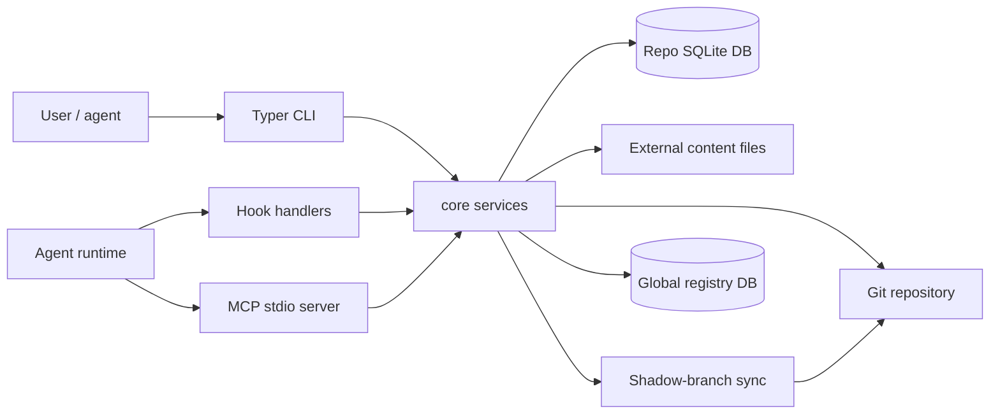
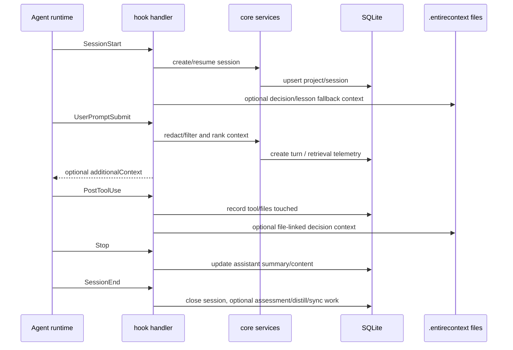
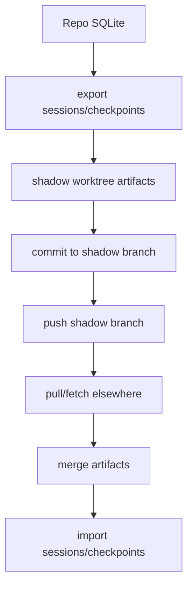

# EntireContext Project Manual

_Last reviewed: 2026-06-22_

EntireContext is **git-anchored decision memory for coding agents**. It captures engineering work as it happens, distills reusable decisions and lessons, retrieves the right context when related work appears, and helps agents or maintainers intervene before repeating old mistakes.

This manual is a long-form orientation and maintenance guide. It does not replace the narrower source-of-truth documents:

- `README.md` remains the quick-start and product entry point.
- `docs/spec.md` remains the compact implementation reference.
- `docs/decisions_outcomes.md` owns the decision-outcome vocabulary.
- `AGENTS.md` owns repository workflow policy for agents.
- `CLAUDE.md` remains the compact contributor and compatibility reference.
- `ROADMAP.md` owns product direction and future intent.

When this manual summarizes a drift-prone fact, prefer the cited code path, contract test, or canonical document over the prose here.

## 1. Executive Overview

### 1.1 What EntireContext is

EntireContext is a local-first memory system for software work. Its core object is not a chat transcript; it is reusable engineering judgment: decisions, rejected alternatives, lessons, feedback, checkpoints, and retrieval traces tied back to git repositories.

The product wedge is narrow on purpose. Coding agents already produce plenty of raw history. The hard part is making previous reasoning reappear at the next useful moment. EntireContext focuses on this loop:

```text
capture -> distill -> retrieve -> intervene -> outcome
```

- **Capture** records sessions, turns, tool use, checkpoints, files, and git state.
- **Distill** converts raw work into assessments, lessons, and decision candidates.
- **Retrieve** searches turns, sessions, symbols, checkpoints, assessments, and decisions.
- **Intervene** surfaces relevant decisions or lessons before and during related work.
- **Outcome** records whether surfaced guidance was accepted, ignored, contradicted, refined, or replaced.

The implementation is anchored in git and SQLite. Hooks collect local activity; CLI commands expose human workflows; MCP tools expose agent workflows; optional sync exports artifacts through a shadow branch.

### 1.2 What problem it solves

Without a dedicated memory loop, engineering judgment is scattered across terminal scrollback, agent chats, PR threads, commits, and local notes. A future agent can search code, but it usually cannot answer:

- Why did this pattern win over the rejected alternative?
- Which prior decision is now stale because the linked file changed?
- Which lesson was confirmed by feedback rather than guessed by a model?
- Which checkpoint or session explains the current shape of a file?
- Which surfaced guidance actually changed the next implementation?

EntireContext stores those relationships explicitly so agents can reuse them.

### 1.3 What is current behavior versus intent

Current behavior is implemented in the Python package under `src/entirecontext/`, the tests under `tests/`, and the user documentation in `README.md` and `docs/spec.md`. Roadmap items, brainstorms, research notes, and plan documents are useful context but are not shipped behavior unless code or tests confirm them.

Treat these categories separately:

| Category | Examples | How to read it |
|---|---|---|
| Current implementation | `src/entirecontext/**`, `tests/**`, `pyproject.toml` | Source of truth for behavior. |
| Current user docs | `README.md`, `docs/spec.md`, `docs/decisions_outcomes.md` | Contract-oriented summaries; verify drift-prone facts against code/tests. |
| Workflow policy | `AGENTS.md`, `CLAUDE.md` | Agent and contributor operating rules. |
| Product direction | `ROADMAP.md` | Intent and planned work, not automatically shipped behavior. |
| Design history | `docs/brainstorms/**`, `docs/research/**`, `docs/superpowers/**`, `docs/plans/**` | Context and rationale; label as historical/proposal/plan when cited. |

### 1.4 Package and platform snapshot

At the time of this review, package metadata and runtime constants agree on version **0.9.3** (`pyproject.toml`, `src/entirecontext/__init__.py`). Python support is **3.12+** in project metadata and CI. The local schema version is **14** (`src/entirecontext/db/schema.py`).

Those facts are intentionally called out as drift-sensitive. If they change, update the package metadata, code constant, changelog/schema references, and docs together.

## 2. Concepts and Terminology

### 2.1 Repository memory versus chat memory

Chat memory preserves conversation. Repository memory preserves work context in relation to a git repository. EntireContext records sessions, turns, files, checkpoints, events, assessments, decisions, outcomes, and retrieval telemetry so a future agent can relate a new task to past repository state.

The distinction matters: a transcript can say what happened; a decision record should say what was chosen, why, what alternatives were rejected, and which files or checkpoints make the decision relevant.

### 2.2 Core records

| Term | Meaning | Primary storage/source |
|---|---|---|
| Project | A registered git repository. | `projects` table. |
| Agent | An actor that produced work, optionally parented to another agent. | `agents` table. |
| Session | A contiguous coding-agent or human-agent work session. | `sessions` table. |
| Turn | A user prompt and assistant response summary, with files/tools metadata. | `turns`, `turn_content`. |
| Checkpoint | A git-anchored snapshot of progress and diff state. | `checkpoints`. |
| Event | A higher-level grouping of sessions/checkpoints. | `events`, `event_sessions`, `event_checkpoints`. |
| Assessment | An evaluation of a diff/checkpoint against roadmap or product value. | `assessments`. |
| Lesson | Guidance distilled from assessed work and feedback. | `LESSONS.md`, futures commands/tools. |
| Decision | Reusable engineering intent: chosen direction, rationale, scope, alternatives, evidence, staleness. | `decisions` and decision link tables. |
| Retrieval event | A recorded search or surfacing operation. | `retrieval_events`. |
| Retrieval selection | A selected result from a retrieval event. | `retrieval_selections`. |
| Context application | A record that retrieved context was used. | `context_applications`. |
| Decision candidate | A proposed decision extracted from session/checkpoint/assessment material before review. | `decision_candidates`. |

### 2.3 Data locations

EntireContext uses local project state plus optional global state:

- A repo-local `.entirecontext/` directory stores configuration, SQLite state, content files, fallback context files, and generated artifacts.
- A global user-level configuration file can provide defaults that repo-local config overrides.
- A global registry database tracks repositories for cross-repo workflows.
- Optional sync uses a git shadow branch for portable artifacts.

This manual avoids machine-specific absolute paths. Use command output and config values in your own environment to locate the concrete files.

### 2.4 Decision states and outcomes

Decision records carry `staleness_status` values such as fresh, stale, superseded, and contradicted. Retrieval treats those states differently: fresh guidance is preferred; stale guidance is demoted or optionally included; superseded guidance should resolve to the successor; contradicted guidance is hidden from normal retrieval surfaces.

Decision outcomes are the feedback vocabulary: `accepted`, `ignored`, `contradicted`, `refined`, and `replaced`. The canonical semantics live in `docs/decisions_outcomes.md`; this manual links to that file instead of duplicating every rule.

## 3. First Run and Daily Use

### 3.1 Install and requirements

The package is Python-based and currently targets Python 3.12+. The README is the source for installation commands and optional extras. At a conceptual level:

1. Install the package and any desired extras.
2. Initialize a git repository with `ec init`.
3. Enable capture integrations with `ec enable` for the relevant agent surface.
4. Use the agent normally.
5. Inspect status, sessions, decisions, checkpoints, and lessons through CLI or MCP.

Use safe placeholder values in examples. Do not put real tokens, private prompts, customer data, or secret keys into docs or demos.

### 3.2 Initialize, enable, disable, and inspect status

The project command surface is registered in `src/entirecontext/cli/project_cmds.py` and includes:

- `ec init` — create or initialize repo-local EntireContext state.
- `ec enable` — install supported hooks or notification wiring.
- `ec disable` — remove supported hook or notification wiring.
- `ec status` — show capture/project/session status.
- `ec config` — read or write configuration values.
- `ec doctor` — inspect installation and integration health.

Enable/disable commands can modify local hook files or local agent configuration. Review their output before assuming capture is active.

### 3.3 Day-to-day workflows

Common workflows are grouped by intent rather than by module:

| Workflow | Commands to start with | Notes |
|---|---|---|
| Search memory | `ec search`, `ec related`, `ec ast-search` | Regex/FTS/session-related and symbol search. |
| Inspect sessions | `ec session list`, `ec session show`, `ec session current`, `ec session export` | Session commands live under the `session` typer group. |
| Create checkpoints | `ec checkpoint create`, `ec checkpoint list`, `ec checkpoint show`, `ec checkpoint diff` | Checkpoints are git-anchored and can be created manually or by hooks. |
| Rewind context | `ec rewind` | Shows state at a checkpoint; it is not a magic rollback guarantee. |
| Record decisions | `ec decision create`, `ec decision link`, `ec decision outcome`, `ec decision supersede` | Link decisions to files, commits, checkpoints, or assessments when possible. |
| Assess and learn | `ec futures assess`, `ec futures feedback`, `ec futures lessons` | Feedback is what turns assessments into durable lessons. |
| Sync artifacts | `ec sync`, `ec pull` | Uses shadow-branch artifact flow when configured. |
| Serve MCP | `ec mcp serve` | Starts stdio MCP transport when MCP dependencies are installed. |
| Maintain storage | `ec purge`, `ec compact`, `ec index` | Use with care; inspect command help and output. |

For exhaustive flags, run `ec <command> --help` instead of relying on this manual.

### 3.4 Safe examples

Use placeholders:

```bash
ec decision create "Prefer explicit parser errors" \
  --rationale "It makes agent-visible failures easier to diagnose" \
  --scope "src/example/parser.py"

ec decision outcome <decision-id> --outcome accepted --note "Applied to the parser refactor"
```

Avoid examples containing real keys, private repository paths, or raw production data.

## 4. Agent Integration Guide

### 4.1 MCP as the agent-facing interface

MCP tools are the preferred surface for agents that need context during work. The stdio MCP server is in `src/entirecontext/mcp/server.py`; tools are registered from modules under `src/entirecontext/mcp/tools/`.

Tool categories:

| Category | MCP tools |
|---|---|
| Search and related context | `ec_search`, `ec_related`, `ec_ast_search`, `ec_activate` |
| Sessions and content | `ec_session_context`, `ec_turn_content`, `ec_attribution`, `ec_context_apply` |
| Checkpoints | `ec_checkpoint_list`, `ec_rewind` |
| Futures and lessons | `ec_assess`, `ec_assess_create`, `ec_feedback`, `ec_lessons`, `ec_assess_trends` |
| Dashboard and graph | `ec_dashboard`, `ec_graph` |
| Decisions | `ec_decision_context`, `ec_decision_create`, `ec_decision_get`, `ec_decision_list`, `ec_decision_outcome`, `ec_decision_related`, `ec_decision_search`, `ec_decision_stale` |
| Decision candidates | `ec_decision_candidate_list`, `ec_decision_candidate_get`, `ec_decision_candidate_confirm`, `ec_decision_candidate_reject` |

`tests/test_contract_sync.py` checks that the exported MCP tool set and README tool table stay aligned. Update code, README, and contract tests together when this surface changes.

### 4.2 When an agent should retrieve context

Agents should prefer proactive context when available, then explicit retrieval when the task needs more grounding.

Use `ec_decision_context` when:

- The agent is starting a non-trivial task.
- The current session has files, diff, checkpoint, or recent-turn signals.
- The agent wants ranked decisions and `selection_id` values without assembling a query.

Use `ec_decision_related` when:

- The agent has explicit files, assessment IDs, or diff text.
- It needs a more targeted decision lookup than the current session provides.

Use `ec_lessons` or futures lessons when:

- Prior assessed work may contain actionable guidance.
- The task revisits an area with repeated bugs or refactors.

Use `ec_checkpoint_list`, `ec_session_context`, or `ec_related` when:

- The agent needs historical work context rather than decision records alone.
- It needs to inspect what happened in a prior session or checkpoint.

After applying retrieved context, record usage with `ec_context_apply` or decision outcomes where appropriate. This closes the feedback loop and improves future ranking.

### 4.3 Proactive decision injection

The `UserPromptSubmit` hook can rank top decisions against the current prompt and inject them as additional context. This is controlled by `[decisions.injection]` config keys such as `inject_on_user_prompt`, `top_k`, `max_tokens`, `min_confidence`, and `inject_timeout_ms`.

The hook path is timeout-aware. If injection cannot complete within the configured budget, the agent should continue and optionally use explicit MCP retrieval.

### 4.4 Mid-session surfacing

When configured, `PostToolUse` can surface decisions linked to files just edited. The current implementation writes a session-scoped fallback file named like `.entirecontext/decisions-context-tooluse-<session>.md` and avoids colliding with the SessionStart fallback.

This is meant to catch decisions at edit time, not only at session start. It is deduplicated to reduce repeated noise.

### 4.5 Templates

`docs/templates/` contains reusable agent guidance:

- `entirecontext-maintainer-decision-reuse-template.md`
- `entirecontext-user-decision-reuse-template.md`
- `entirecontext-proactive-guidance.md`

Use those templates as policy snippets for agents; keep them aligned with implemented MCP tools and hook behavior.

## 5. Architecture Walkthrough

### 5.1 System topology



Key layers:

- **CLI layer** (`src/entirecontext/cli/`) registers Typer command modules.
- **Hook layer** (`src/entirecontext/hooks/`) receives agent and git lifecycle events.
- **MCP layer** (`src/entirecontext/mcp/`) exposes context tools to agents.
- **Core services** (`src/entirecontext/core/`) implement search, decisions, futures, telemetry, config, checkpoints, compacting, and related behavior.
- **Database layer** (`src/entirecontext/db/`) owns schema, migrations, connections, and global registry schema.
- **Sync layer** (`src/entirecontext/sync/`) exports/imports artifacts and coordinates the shadow branch flow.

### 5.2 CLI layer

`src/entirecontext/cli/__init__.py` creates the root Typer app and imports command modules. Each module exposes `register(app)` and either adds a command or a Typer sub-application. This keeps the CLI grouped by workflow while preserving a single `ec` entry point.

Major command groups include project setup, search, sessions, hooks, checkpoints, sync/pull, rewind, repo, events, blame, indexing, MCP serving, import, futures, purge, graph, dashboard, context telemetry, decision memory, and compacting.

### 5.3 Hook layer

`src/entirecontext/hooks/handler.py` dispatches hook types to implementation functions:

```text
SessionStart -> session_lifecycle.on_session_start
UserPromptSubmit -> turn_capture.on_user_prompt plus proactive surfacing
Stop -> turn_capture.on_stop
PostToolUse -> turn_capture.on_tool_use plus decision surfacing
SessionEnd -> session_lifecycle.on_session_end
PostCommit -> session_lifecycle.on_post_commit
```

The hook layer is intentionally defensive: hook failures should not crash the host agent session. It records warnings or operation events where possible.

### 5.4 Hook-to-storage sequence



### 5.5 Core services

The core package is intentionally broad. Important modules include:

- `config.py` — default/global/repo-local TOML config merge.
- `search.py`, `embedding.py`, `ast_index.py` — retrieval and indexing.
- `decisions.py`, `decision_candidates.py`, `decision_extraction.py`, `decision_prompt_surfacing.py` — decision memory lifecycle.
- `futures.py`, `auto_assess.py`, `lesson_surfacing.py` — assessments, feedback, lessons.
- `checkpoint.py`, `session.py`, `turn.py`, `event.py` — captured work records.
- `telemetry.py`, `context.py` — retrieval/context instrumentation and transaction helpers.
- `content_filter.py`, `security.py` — capture-time filtering and secret redaction.
- `compact.py`, `consolidation.py` — retention and compaction workflows.

### 5.6 Sync flow



The sync coordinator initializes or updates a shadow branch, exports artifacts, commits changes, pushes when configured, and can fetch/merge/import remote artifacts. Security filtering is enabled by default for exported session text unless explicitly disabled.

## 6. Data Model and Storage

### 6.1 Schema version and SQLite posture

The local schema version is **14** and the minimum SQLite version is **3.38.0+**. Schema definitions live in `src/entirecontext/db/schema.py`; migrations live under `src/entirecontext/db/migrations/`.

### 6.2 Table groups

The schema is best understood by group:

| Group | Tables | Purpose |
|---|---|---|
| Project/session capture | `projects`, `agents`, `sessions`, `turns`, `turn_content` | Record who worked, where, and what happened. |
| Git checkpoints and events | `checkpoints`, `events`, `event_sessions`, `event_checkpoints`, `attributions` | Tie memory to git state and higher-level work groupings. |
| Retrieval and indexing | `embeddings`, `ast_symbols`, FTS tables, retrieval telemetry | Make content searchable and audit retrieval. |
| Assessments and lessons | `assessments`, `assessment_relationships` | Evaluate changes and feed lesson generation. |
| Decisions | `decisions`, `decision_commits`, `decision_checkpoints`, `decision_files`, `decision_assessments`, `decision_outcomes`, `decision_candidates` | Store reusable engineering decisions and their lifecycle. |
| Sync/operations | `sync_metadata`, `operation_events` | Track sync state and background/operation telemetry. |
| Context use | `retrieval_events`, `retrieval_selections`, `context_applications` | Record what was retrieved and how it was used. |

### 6.3 FTS and embeddings

The project uses FTS5 virtual tables for searchable text surfaces, including turns, events, sessions, AST symbols, decisions, and decision candidates. Embeddings are stored separately by source type, source ID, model, dimensions, vector blob, and text hash. Semantic search is optional and should degrade gracefully if the semantic extra is unavailable.

### 6.4 Content externalization

Large turn content can be stored outside the main row and referenced by `turn_content.content_path`, size, and hash. This keeps the core turn table compact while preserving full content when enabled and retained.

### 6.5 Local and global databases

The repo-local database owns repository-specific sessions, turns, decisions, and checkpoints. The global registry schema tracks repositories and supports cross-repo discovery. Cross-repo behavior should not be described as a replacement for local source-of-truth data; it is a registry and retrieval aid.

### 6.6 Migration and compatibility posture

Migrations are versioned Python modules. When changing schema or long-lived data contracts, update migrations, schema constants, docs, changelog/schema references, and contract tests together. Repository policy requires extra care around version/schema drift.

## 7. Configuration and Environment

### 7.1 Config precedence

Configuration merges in this order:

```text
defaults <- global config <- repo-local config
```

`src/entirecontext/core/config.py` defines defaults and merge behavior. Repo-local config is under `.entirecontext/config.toml`; global config is user-level.

### 7.2 Major config sections

| Section | Purpose |
|---|---|
| `[capture]` | Auto-capture, checkpoint hooks, content retention, AAR, Codex idle closing, lesson surfacing. |
| `[capture.exclusions]` | Capture-time content/file/tool exclusions and redaction patterns. |
| `[search]` | Default search mode and semantic model. |
| `[sync]` | Auto-sync, pull/push timing, cooldowns, quiet mode. |
| `[display]` | Result count and color preferences. |
| `[security]` | Secret filtering toggle and redaction regex patterns. |
| `[filtering.query_redaction]` | Query redaction before external or semantic processing. |
| `[index]` | Embedding/indexing defaults. |
| `[futures]` | Assessment backend/model, lesson output, enrichment/backfill behavior. |
| `[decisions]` | Decision stale/extract/surfacing/inference behavior. |
| `[decisions.ranking]` | Weights for staleness, assessment relations, files, commits, and directory proximity. |
| `[decisions.quality]` | Decision quality scoring parameters. |
| `[decisions.extraction]` | Outcome-feedback influence on candidate extraction. |
| `[decisions.injection]` | Proactive decision injection limits and timeout. |

### 7.3 Safe config examples

Use placeholders and local-only dummy values:

```toml
[capture]
auto_capture = true
content_retention_days = 30

[security]
filter_secrets = true

[decisions.injection]
inject_on_user_prompt = true
top_k = 5
max_tokens = 800
```

Do not publish real API keys or model-provider credentials in config snippets.

### 7.4 Defaults that affect side effects

Important defaults include automatic capture, checkpoint-on-commit, secret filtering, decision auto-embedding, and proactive injection. Some automation remains opt-in, such as auto-sync and selected decision extraction/surfacing paths. Always inspect current defaults in `config.py` before documenting exact behavior.

## 8. CLI Reference by Workflow

This chapter is intentionally workflow-oriented. Use `ec --help` and `ec <group> --help` for exhaustive flags.

### 8.1 Project setup and status

- `ec init`
- `ec enable`
- `ec disable`
- `ec status`
- `ec config`
- `ec doctor`

These commands manage repo state, hooks, supported agent integration, configuration, and diagnostics.

### 8.2 Session inspection and export

- `ec session list`
- `ec session show`
- `ec session current`
- `ec session export`
- `ec session consolidate`
- `ec session graph`
- `ec session activate`
- `ec session backfill-ended-at`
- `ec session backfill-applied`

Use these to inspect captured work, export session content, build session graphs, and repair/backfill session metadata.

### 8.3 Search and graph exploration

- `ec search`
- `ec related`
- `ec ast-search`
- `ec graph`
- `ec dashboard`
- `ec blame`

Search commands can operate over turns/sessions and symbols. Graph/dashboard/blame commands provide higher-level views of memory and attribution.

### 8.4 Checkpoints, rewind, events, and attribution

- `ec checkpoint create/list/show/diff/assess-accuracy`
- `ec rewind`
- `ec event list/show/create/link`
- `ec context select/apply`

Use checkpoints to preserve git-anchored state, events to group work, rewind to inspect checkpoint state, and context telemetry to record retrieval use.

### 8.5 Decision memory

- `ec decision create`
- `ec decision list`
- `ec decision show`
- `ec decision rejected-alternatives`
- `ec decision link`
- `ec decision stale`
- `ec decision outcome`
- `ec decision update`
- `ec decision supersede`
- `ec decision unlink`
- `ec decision search`
- `ec decision chain`
- `ec decision stale-all`
- `ec decision extract-candidates`
- `ec decision extract-from-session`
- `ec decision surface-prompt`
- `ec decision candidates ...`
- `ec decision alternatives ...`

Decision commands are central to the product. Prefer linking decisions to files/checkpoints/assessments and recording outcomes after use.

### 8.6 Futures, feedback, lessons, and workers

- `ec futures assess`
- `ec futures list`
- `ec futures feedback`
- `ec futures lessons`
- `ec futures enrich-backlog`
- `ec futures relate/relationships/unrelate`
- `ec futures trend/report/tidy-pr`
- `ec futures worker-status/worker-stop/worker-launch`

Futures commands evaluate change impact, capture feedback, generate lessons, and manage related background processing.

### 8.7 Sync, import, purge, compact, MCP serving

- `ec sync`
- `ec pull`
- `ec import`
- `ec purge session/turn/match`
- `ec compact`
- `ec index`
- `ec mcp serve`

These commands affect storage, import/export, or agent-server behavior. Treat destructive cleanup and sync operations as operational actions; inspect help/output before use.

## 9. MCP Reference by Workflow

### 9.1 Search and retrieval

- `ec_search` searches captured turns/sessions.
- `ec_related` finds related sessions/turns by query or files.
- `ec_ast_search` searches indexed symbols.
- `ec_activate` performs spread-activation retrieval from a seed.

### 9.2 Session and checkpoint context

- `ec_session_context` returns session details and recent turns.
- `ec_turn_content` returns full content for a turn.
- `ec_attribution` returns attribution for files or lines.
- `ec_checkpoint_list` lists checkpoints.
- `ec_rewind` shows state at a checkpoint.

### 9.3 Decision workflows

- `ec_decision_context` performs one-call proactive decision retrieval.
- `ec_decision_related` ranks linked decisions against explicit signals.
- `ec_decision_search` searches decision records.
- `ec_decision_get` resolves a decision.
- `ec_decision_list` lists decisions with filters.
- `ec_decision_create` creates a decision.
- `ec_decision_outcome` records usage feedback.
- `ec_decision_stale` probes staleness.

Decision candidate tools list, inspect, confirm, or reject candidate decisions before they become durable records.

### 9.4 Futures, lessons, and telemetry

- `ec_assess` and `ec_assess_create` work with assessments.
- `ec_feedback` records agreement/disagreement feedback.
- `ec_lessons` generates lessons from assessed feedback.
- `ec_assess_trends` summarizes trends.
- `ec_context_apply` records how retrieved context was applied.

### 9.5 Error and repo-resolution expectations

MCP tools resolve repository context through the MCP runtime and repo database helpers. They should return structured or JSON-like payloads rather than crashing the agent host. Input normalization is especially important for agent callers; repository filters may accept strings or lists depending on the tool implementation.

## 10. Hook Lifecycle and Automation

### 10.1 SessionStart

Creates or resumes a session and can surface broad-context decisions or lessons. It may write fallback Markdown under `.entirecontext/` when direct context injection is unavailable or inappropriate.

### 10.2 UserPromptSubmit

Records the start of a turn and can run proactive decision injection. The prompt path applies capture exclusions and redaction before storage or surfacing work. Injection is bounded by configuration limits so the agent session can continue if ranking times out.

### 10.3 Stop

Records assistant response summary and, where available, transcript-derived content. Content is redacted according to config before storage.

### 10.4 PostToolUse

Tracks tool usage and files touched for the active turn. When enabled, decision surfacing can identify decisions linked to just-edited files and write a session-scoped fallback file.

### 10.5 SessionEnd

Marks sessions ended, updates global counts, may infer applied or ignored decisions, can emit after-action review output, consolidate old turns, create auto-checkpoints, backfill or catch up assessments, trigger embedding/distillation, check stale decisions, extract candidates, and trigger background sync depending on configuration.

### 10.6 PostCommit and pre-push sync

`PostCommit` creates checkpoints for active sessions and can trigger assessment-related work. Git pre-push sync is documented in repository policy and should be treated as enabled only when the local hook/config actually installs it.

### 10.7 Capture-disabled and fallback behavior

Capture can be disabled globally or per session. Filtering can skip turns, files, or tools. Fallback context files are operational artifacts, not source files; they should not be confused with durable documentation.

## 11. Decision Memory Deep Dive

### 11.1 Decision creation and linking

A decision should contain:

- A concise title.
- Rationale explaining why this option was chosen.
- Scope describing where it applies.
- Rejected alternatives when known.
- Supporting evidence or links to commits, checkpoints, files, or assessments.

Linking matters because retrieval uses file, commit, assessment, and session signals. A decision with no links can still be searched by text, but it is less likely to surface at the right moment.

### 11.2 Staleness and supersession

Staleness prevents old guidance from dominating new work. Decisions can be fresh, stale, superseded, or contradicted. Supersession chains point from older decisions to newer successors; the CLI includes a chain-walk command for debugging.

### 11.3 Outcome recording

Outcomes record what happened when guidance was surfaced or applied:

- `accepted`: the decision was followed.
- `ignored`: the decision was surfaced but not used.
- `contradicted`: later evidence showed the decision was wrong.
- `refined`: the decision was partially adapted.
- `replaced`: a newer decision superseded it.

Use `docs/decisions_outcomes.md` for canonical semantics and edge cases.

### 11.4 Quality signals and ranking

Decision ranking uses text, file overlap, git commit signals, assessment relationships, staleness, and quality/outcome signals. Defaults are configurable under `[decisions.ranking]`, `[decisions.quality]`, and `[decisions.extraction]`.

### 11.5 Context applications

A context application records that a retrieved item influenced work. This is separate from raw retrieval. Recording applications and outcomes is what turns retrieval into a closed feedback loop.

### 11.6 Candidate extraction

Decision candidates are extracted from sessions, checkpoints, or assessments and remain pending until confirmed or rejected. This avoids automatically turning noisy history into durable policy. Candidate promotion should preserve rationale, alternatives, source links, and confidence context.

### 11.7 Lessons and assessments

Assessments evaluate changes; feedback confirms or rejects that evaluation; lessons distill repeated guidance. Lessons are not a replacement for decisions. Decisions capture engineering choices; lessons capture generalized guidance from assessed outcomes.

## 12. Sync, Filtering, and Cross-Repo Memory

### 12.1 Shadow branch purpose

Shadow-branch sync exports portable artifacts rather than raw local database files. This makes sync git-native while keeping the working branch separate from memory artifacts.

### 12.2 Export/import model

`perform_sync` exports sessions and checkpoints since the last export, commits artifacts in a shadow worktree, pushes when configured, fetches remote shadow state when needed, merges artifacts, and records sync metadata. `perform_pull` imports remote artifacts into the local database.

### 12.3 Filtering boundaries

There are multiple filtering layers:

- Capture-time exclusions can skip turns, files, or tools and redact content.
- Query redaction can filter prompts before semantic or external processing.
- Sync/export secret filtering redacts exported text by default.

Filtering reduces exposure risk but is not a license to store secrets. Prefer not capturing secrets in the first place.

### 12.4 Cross-repo memory

The global registry and cross-repo tools help locate memory across repositories. They do not remove the need to verify current repo state. A decision from another repo can be useful context, but local code and current tests decide applicability.

### 12.5 Operational risks and recovery

Sync can fail due to missing shadow refs, merge conflicts, transport errors, or filtering assumptions. Inspect `sync_metadata`, operation events, command output, and shadow branch artifacts before retrying blindly.

## 13. Development and Maintenance

### 13.1 Repository layout

| Path | Role |
|---|---|
| `src/entirecontext/cli/` | Typer CLI command surface. |
| `src/entirecontext/core/` | Business logic and services. |
| `src/entirecontext/db/` | Schema, migrations, connection helpers. |
| `src/entirecontext/hooks/` | Agent/git hook handlers. |
| `src/entirecontext/mcp/` | MCP server and tools. |
| `src/entirecontext/sync/` | Shadow-branch sync and artifact flow. |
| `tests/` | Contract, unit, integration, and real-git fixture tests. |
| `docs/` | Specs, ADRs, research, plans, templates, and manuals. |
| `.github/workflows/ci.yml` | CI validation surfaces. |

### 13.2 Development setup and tests

CI runs linting with ruff, type checking with mypy, and tests on Python 3.12 and 3.13. Repository policy says that when modifying a source module, run the existing tests for that module, not only newly written tests.

Useful validation commands from repo docs and CI include:

```bash
uv run ruff check .
uv run mypy src/entirecontext/
uv run pytest
uv run pytest tests/test_contract_sync.py
```

If local cache permissions fail, use a writable cache location such as a temporary directory and record that choice in verification evidence.

### 13.3 Adding CLI commands

Repository policy requires new CLI commands to:

1. Create or update `cli/<name>_cmds.py` with Typer command decorators.
2. Import and register the module in `cli/__init__.py`.
3. Keep business logic in `core/` where possible.
4. Add a corresponding MCP tool when useful for agent workflows.
5. Update compact reference docs such as `CLAUDE.md` when a new module surface matters.

### 13.4 Adding MCP tools

MCP tools should be implemented in `src/entirecontext/mcp/tools/`, registered through `register_tools()`, exported in `server.__all__`, and documented in the README Available Tools table. `tests/test_contract_sync.py` is the guard for registration/README drift.

### 13.5 ADR and decision reuse policy

Durable architecture decisions belong in `docs/adr/` using the ADR process. EC decisions can stay lightweight, but decisions that become project-wide policy should graduate to an ADR or reference one.

Agents working in this repository must retrieve and apply relevant decisions and lessons for non-trivial work. Decisions are inputs to judgment, not unquestioned rules; verify fit against current code and task intent.

### 13.6 Measure-first principle

Before implementing feature or behavior changes, define the measurable success criterion and verify the measurement infrastructure. This is especially important for dashboard, assessment, telemetry, retrieval, and ranking work.

### 13.7 Release/version alignment

Version and schema drift have been a repeated risk. When releasing or changing schema:

- Keep `pyproject.toml` and `src/entirecontext/__init__.py` aligned.
- Keep `SCHEMA_VERSION`, migrations, changelog schema references, README/spec mentions, and contract tests aligned.
- Verify `tests/test_contract_sync.py` when touching MCP tools, README tool docs, fallback filenames, or schema/changelog references.

## 14. Troubleshooting and Runbooks

| Symptom | Likely cause | First checks |
|---|---|---|
| `ec` command not found | Package not installed or environment not activated | Check install environment, `uv run ec --help`, and PATH. |
| Not a git repository | Commands requiring repo root cannot resolve project | Run inside a git repo or initialize one. |
| No active session | Hooks not enabled, capture disabled, or session ended | `ec status`, hook config, `.entirecontext/config.toml`. |
| Hook not firing | Agent hook config missing or overwritten | `ec doctor`, `ec enable`, hook files/config. |
| Capture missing turns | `capture.auto_capture=false`, per-session disabled, or exclusions matched | Config `[capture]` and `[capture.exclusions]`. |
| MCP server unavailable | MCP extra missing or stdio server not configured | `ec mcp serve`, package extras, agent MCP settings. |
| MCP tool list mismatch | Registration/export/docs drift | `tests/test_contract_sync.py`, `mcp/server.py`, README Available Tools. |
| SQLite migration issue | Schema version mismatch or migration failure | `src/entirecontext/db/schema.py`, migrations, command output. |
| Sync conflict or missing snapshot | Shadow branch missing, fetch/push failed, merge conflict | `ec sync` output, `sync_metadata`, shadow branch refs. |
| Decisions not surfacing | Config disabled, no links/signals, timeout, stale/contradicted filtering | `[decisions]`, retrieval telemetry, decision links, PDI config. |
| Lessons stale or absent | No assessed feedback, lessons not regenerated, SessionStart surfacing disabled | `ec futures lessons`, `LESSONS.md`, `[capture] surface_lessons_on_start`. |
| Docs contract failure | README/tool/schema/fallback drift | Read failure message in `tests/test_contract_sync.py` and update both sides. |
| Long docs automation timed out | Agent automation produced partial artifacts but did not finish | Inspect `.agent-loop/runs/*/artifacts/*` and summaries before rerunning. |

## 15. Documentation Ownership and Evidence Appendix

### 15.1 Documentation ownership map

| Topic | Owner document/source | Notes |
|---|---|---|
| Product quick start and MCP tool table | `README.md` | Keep skimmable; contract-tested tool table. |
| Implementation reference | `docs/spec.md` | Compact current-behavior reference. |
| Decision outcome semantics | `docs/decisions_outcomes.md` | Canonical outcome vocabulary. |
| Agent workflow policy | `AGENTS.md` | Repository-level autonomous-agent rules. |
| Contributor reference | `CLAUDE.md` | Compact compatibility/contributor guide. |
| Product direction | `ROADMAP.md` | Separate shipped behavior from intent. |
| Durable architecture decisions | `docs/adr/` | Use ADR template/process. |
| Historical ideas and proposals | `docs/brainstorms/`, `docs/research/`, proposal docs | Label as historical/proposal unless code confirms. |
| Comprehensive orientation | This manual | Summarize and link; avoid becoming the only source of truth. |

### 15.2 Evidence matrix

| Manual area | Major claims | Evidence sources |
|---|---|---|
| Product wedge and loop | Decision memory for coding agents; capture/distill/retrieve/intervene spine | `README.md`, `ROADMAP.md`, decision `629f4a79-61b5-46d5-8a22-8311bb83d1ae`. |
| Version/runtime snapshot | Version 0.9.3, Python 3.12+, schema v14 | `pyproject.toml`, `src/entirecontext/__init__.py`, `src/entirecontext/db/schema.py`, `.github/workflows/ci.yml`. |
| CLI registration | Root Typer app and command modules | `src/entirecontext/cli/__init__.py`, `src/entirecontext/cli/*_cmds.py`. |
| Project setup commands | init/enable/disable/status/config/doctor | `src/entirecontext/cli/project_cmds.py`, `README.md`. |
| MCP tool surface | 29 exported `ec_*` tools grouped by workflow | `src/entirecontext/mcp/server.py`, `src/entirecontext/mcp/tools/*.py`, `tests/test_contract_sync.py`, `README.md`. |
| Hook lifecycle | SessionStart, UserPromptSubmit, Stop, PostToolUse, SessionEnd, PostCommit | `src/entirecontext/hooks/handler.py`, `session_lifecycle.py`, `turn_capture.py`, `decision_hooks.py`, `README.md`. |
| Data model | Schema v14, table groups, FTS, candidates, retrieval telemetry | `src/entirecontext/db/schema.py`, `docs/spec.md`. |
| Configuration | Defaults and merge order | `src/entirecontext/core/config.py`, `README.md`, `docs/spec.md`. |
| Search and indexing | Regex/FTS/AST/semantic concepts | `src/entirecontext/core/search.py`, `embedding.py`, `ast_index.py`, MCP search tools. |
| Decision lifecycle | Staleness, outcomes, supersession, candidates | `src/entirecontext/core/decisions.py`, `src/entirecontext/cli/decisions_cmds.py`, `src/entirecontext/mcp/tools/decisions.py`, `docs/decisions_outcomes.md`. |
| Futures and lessons | Assessments, feedback, generated lessons | `src/entirecontext/core/futures.py`, `src/entirecontext/cli/futures_cmds.py`, `LESSONS.md`. |
| Sync/filtering | Shadow branch, export/import, secret filtering | `src/entirecontext/sync/coordinator.py`, `export_flow.py`, `security.py`, `core/content_filter.py`, `docs/spec-ec-sync-no-filter.md`. |
| Development policy | Tests, ADRs, measure-first, decision reuse | `AGENTS.md`, `CLAUDE.md`, `docs/adr/README.md`, `.github/workflows/ci.yml`, `tests/conftest.py`. |
| Contract drift prevention | README/MCP/schema/fallback guards | `tests/test_contract_sync.py`, decision `dffae62d-0d8b-4c17-9102-f77eca1532e8`. |
| Release/version alignment | `__version__` and schema drift risk | decision `b148ba4d-702c-4dac-97a7-aa5551a70246`, `CHANGELOG.md`, `pyproject.toml`, `src/entirecontext/__init__.py`. |
| Historical/proposal status | Brainstorms/research/proposals are not shipped behavior by default | `docs/brainstorms/**`, `docs/research/**`, `docs/documentation_in_prs_proposal.md`, `docs/tiered_review_policy_proposal.md`, `docs/plans/**`. |
| Prior automation artifacts | Useful research prompts, not authoritative source | `.agent-loop/runs/*/artifacts/*`, run summaries, current source files. |

### 15.3 Contract-tested facts

`tests/test_contract_sync.py` currently guards:

1. MCP `server.__all__` `ec_*` exports against registered tool functions.
2. README Available Tools entries against MCP exports, bidirectionally.
3. Decision-hook fallback filenames against README documentation.
4. Current `SCHEMA_VERSION` against a schema-related changelog paragraph.

These are not full documentation tests. They are targeted drift guards for surfaces that have drifted before.

### 15.4 Manual-review-only facts and gaps

The repository does not currently have a dedicated Markdown link checker or prose documentation linter. Manual review must cover:

- Internal relative links.
- Whether proposal/history docs are labeled correctly.
- Whether examples use placeholders only.
- Whether code path summaries still match source.
- Whether new version/schema/tool names are reflected in all owning documents.

### 15.5 Requirements coverage summary

| Requirement | Coverage |
|---|---|
| R1-R4 product and audience value | Chapters 1-2 plus ownership/evidence appendix. |
| R5-R8 operational and agent workflows | Chapters 3-4, 10, 12. |
| R9-R12 implementation and maintainer knowledge | Chapters 5-9, 11, 13. |
| R13-R17 accuracy and reviewability | Evidence matrix, contract-tested facts, verification gaps, and manual-review-only section. |

### 15.6 Known limitations

- This manual groups CLI and MCP surfaces by workflow and intentionally does not duplicate every flag.
- The evidence matrix is compact; reviewers should inspect cited files directly for line-level verification.
- Proposal and research documents are summarized only as categories, not exhaustively indexed.
- Link validation is manual because no dedicated link-checking tool is configured in the repository.
